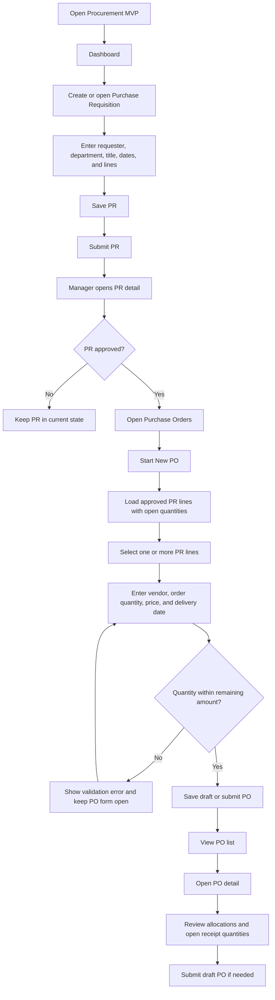
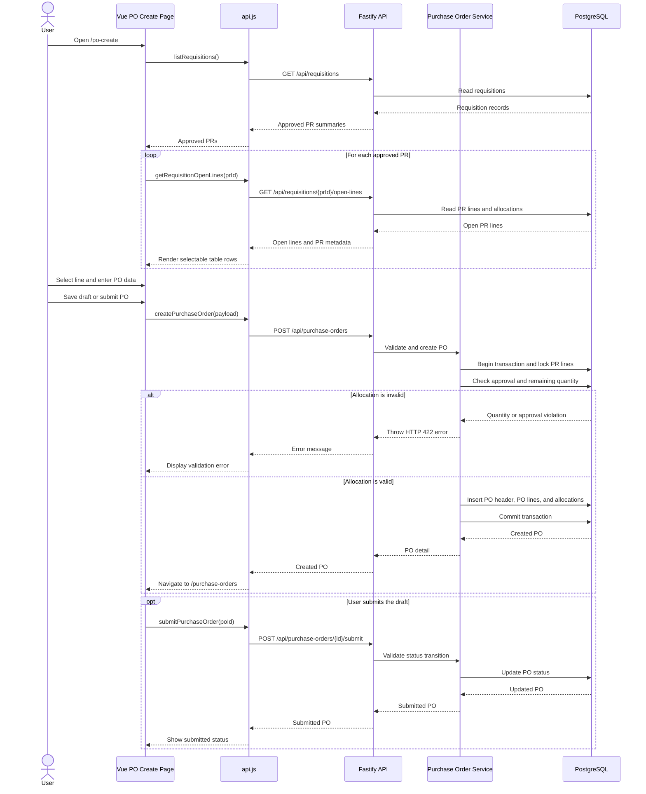

# Procurement MVP Application Flow

## Overview

The application is a Vue 3 and Vite frontend backed by a Fastify REST API and PostgreSQL. It currently supports two business modules:

- **Purchase Requisition (PR):** create, list, view, submit, and approve requisitions.
- **Purchase Order (PO):** list, create from approved PR lines, view details, submit, and inspect open quantities.

Goods Receipt (GR) is not implemented in the current workshop scope.

## Application structure

### Frontend

The Vue application uses Vue Router and keeps HTTP calls in `frontend/src/api.js`. The main routes are:

| Route | Purpose |
| --- | --- |
| `/` | Dashboard with requisition summary data |
| `/requisitions` | PR list |
| `/requisitions/new` | Create a PR |
| `/requisitions/:id` | PR detail, submit, and approve actions |
| `/purchase-orders` | PO list |
| `/po-create` | Create a PO from approved PR lines |
| `/purchase-orders/:id` | PO detail, submit action, and open lines |

The PO create screen uses the reusable `POHeaderForm` and `POLineAllocationTable` components. The table loads only approved requisition lines with remaining quantities. Individual line selection, order quantity, unit price, and delivery date are sent back to the page model before submission.

### Backend

Fastify registers the database plugin, requisition routes, and purchase-order routes. Services contain the database queries and business rules. The API returns JSON and converts non-success responses into frontend errors through the shared API client.

Important PO endpoints:

- `GET /api/purchase-orders` — list POs.
- `POST /api/purchase-orders` — create a draft PO from approved PR lines.
- `GET /api/purchase-orders/:id` — return the PO header, lines, and PR allocations.
- `POST /api/purchase-orders/:id/submit` — change a draft PO to submitted.
- `GET /api/purchase-orders/:id/open-lines` — return lines with quantity still open for receipt.

## Business rules

1. A PO can use only approved PR lines.
2. `qtyOrdered` must be greater than zero.
3. `qtyOrdered` must not exceed the PR line's remaining quantity.
4. Duplicate references to the same PR line are aggregated before validation.
5. PO creation runs in a database transaction and locks the relevant PR lines while checking allocations.
6. A draft PO can be submitted once; invalid transitions return an error.

## User flow

## PO creation sequence

The sequence below describes the main integration path used by the PO create page. The page first finds approved PRs, then requests each PR's open lines. On submission, the backend validates the allocation inside a transaction before creating the PO and its allocation records.

## Testing and delivery checks

- Backend unit tests use Jest and cover PO allocation and status-transition rules.
- Frontend component tests use Vitest and Vue Test Utils.
- PO E2E tests use Playwright for the happy path and over-allocation path.
- Playwright HTML reports are written to `playwright-report/`.
- Screenshots, traces, videos, and JSON results are written to `test-results/`.
- The pre-push hook runs the root `npm test` command and blocks a push if the test command fails.
