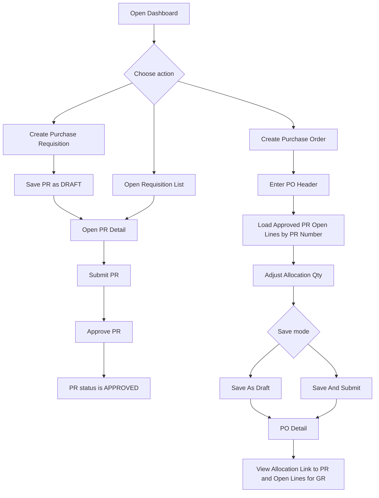
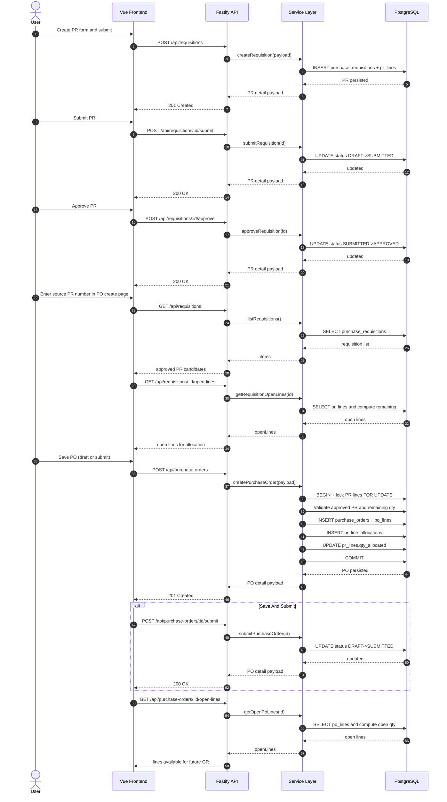

# Current Application Guide

This document describes how the current procurement MVP works today in this repository.

## 1. What is implemented now

Implemented modules:
- Dashboard
- Purchase Requisition (PR): list, create, detail, submit, approve
- Purchase Order (PO): list, create, detail, submit, open-lines lookup

Not implemented in the current UI/API:
- Goods Receipt (GR) flow (planned as later exploration)

## 2. Runtime architecture

- Frontend: Vue 3 + Vite SPA
- Backend: Fastify REST API
- Database: PostgreSQL (Docker)

High-level behavior:
1. User interacts with Vue pages.
2. Frontend calls backend REST endpoints in `frontend/src/api.js`.
3. Fastify route handlers call service functions.
4. Service functions enforce business rules and run SQL.
5. PostgreSQL stores PR/PO data and allocation links.

## 3. Frontend navigation and pages

Main routes:
- `/` -> Dashboard
- `/requisitions` -> PR list
- `/requisitions/new` -> PR create
- `/requisitions/:id` -> PR detail (submit/approve actions)
- `/purchase-orders` -> PO list
- `/purchase-orders/new` -> PO create (allocate from approved PR open lines)
- `/purchase-orders/:id` -> PO detail (submit action)

User entry points:
- Dashboard has quick buttons for creating PR and PO.
- PR List and PO List provide detail links.

## 4. Backend endpoint map

### Requisition endpoints
- `GET /api/requisitions`
- `POST /api/requisitions`
- `POST /api/requisitions/:id/submit`
- `POST /api/requisitions/:id/approve`
- `GET /api/requisitions/:id`
- `GET /api/requisitions/:id/open-lines`

### Purchase Order endpoints
- `GET /api/purchase-orders`
- `POST /api/purchase-orders`
- `POST /api/purchase-orders/:id/submit`
- `GET /api/purchase-orders/:id`
- `GET /api/purchase-orders/:id/open-lines`

Additional endpoints:
- `GET /health`
- `GET /api-docs` (Swagger UI)

## 5. Core business rules currently enforced

### PR rules
- PR create payload must include requester/department/title and at least one line.
- PR line qty requested must be > 0.
- PR status transitions:
  - `DRAFT -> SUBMITTED`
  - `SUBMITTED -> APPROVED`
- Invalid transitions return `422`.

### PO rules
- PO create payload must include `vendorName` and at least one line.
- Each PO line must reference `prLineId`.
- Allocation guard:
  - Each line allocation qty must be > 0.
  - Allocation qty must not exceed PR line remaining qty.
  - Multiple PO lines targeting the same PR line are aggregated and validated in one transaction.
- PR line must belong to an `APPROVED` PR before allocation.
- PO status transitions:
  - `DRAFT -> SUBMITTED`
- Invalid transitions/validation failures return `422`.

## 6. Data behavior and traceability

- Creating PO lines inserts rows into `po_lines`.
- Each PO line creates a row in `pr_line_allocations`.
- `pr_lines.qty_allocated` is incremented during PO creation.
- PO detail enriches each line with source PR allocation information.
- Open-line APIs return only lines where remaining quantity is still positive:
  - PR open for PO: `qty_requested - qty_allocated > 0`
  - PO open for GR: `qty_ordered - qty_received > 0`

## 7. User flow chart

## 8. Sequence diagram

The sequence below shows the most important cross-module flow: create and approve PR, then create and submit PO from PR open lines.

## 9. Error handling behavior

- Known validation and transition errors return `422` with `{ "message": "..." }`.
- Missing entities return `404` with `{ "message": "... not found" }`.
- Unhandled server errors return `500` with `{ "message": "Internal server error" }`.

## 10. Notes on current scope

- The implementation is intentionally workshop-sized and keeps route handlers thin.
- Service functions are the main place for business rules.
- GR lifecycle is still outside current implementation scope.
