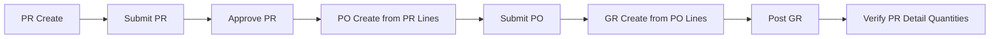

author: Arie M. Prasetyo
summary: GitHub Copilot Workshop - 5 Hours Procurement MVP (VS Code + GitHub)
id: github-copilot-workshop-id
categories: AI, Development
environments: Web
status: Published
feedback link: https://example.com/feedback

# GitHub Copilot Workshop: Build a Procurement MVP in 5 Hours

## About this workshop
Duration: 10

Welcome! In this workshop, participants build a real-world procurement MVP using GitHub Copilot in both VS Code and GitHub.

Application scope:
- Purchase Requisition (PR): create, submit, approve
- Purchase Order (PO): create from approved PR lines, submit
- Goods Receipt (GR): create from PO lines, post
- Tracking: PR detail page showing linked PO/GR and quantities

Tech stack:
- Backend: Fastify + JavaScript
- Frontend: Vue 3 + Vite + JavaScript
- Database: PostgreSQL in Docker
- Testing: Jest + Playwright

---

## Workshop Flow (No Back-and-Forth)
Duration: 10

To keep focus and reduce context switching, we use 3 blocks only:

1. **GitHub block (0-60 min)**
   - Repo setup
   - Copilot Spaces for onboarding + brainstorming
   - Confirm MVP and implementation plan

2. **VS Code block (60-225 min)**
   - Build app end-to-end with Copilot
   - Add Jest + Playwright tests

3. **GitHub block (225-300 min)**
   - PR summary + Copilot review
   - Code scanning and CodeQL analysis
   - Wrap-up and next steps

> aside positive
>
> This structure keeps participants in one tool long enough to build momentum.

---

## Prerequisites
Duration: 10

- VS Code latest
- GitHub account + Copilot license
- Docker Desktop running
- Node.js 20+
- Git
- GitHub Copilot extension

Optional MCP tools:
- GitHub MCP Server
- Figma MCP integration available in Copilot/agent environment

---

## Project Setup (GitHub Block)
Duration: 15

1. Fork workshop repository
2. Clone locally

```bash
git clone https://github.com/<your-org-or-user>/<repo>.git
cd <repo>
git checkout -b feature/procurement-mvp
```

3. Ensure project references:
- `docs/plan.md`
- `.github/copilot-instructions.md`

4. Start PostgreSQL:

```bash
docker compose up -d db
```

5. Apply the pre-provided baseline migration (required):

```bash
docker compose exec -T db psql -U workshop -d procurement_mvp < db/migrations/001_init_procurement_mvp.sql
```

Migration file used by all participants:
- `db/migrations/001_init_procurement_mvp.sql`

> aside positive
>
> We pre-provide the baseline migration so everyone uses the same schema and we avoid workshop delays from migration drift.

---

## Use GitHub Spaces for Onboarding + Brainstorming
Duration: 20

Open Copilot Spaces on GitHub and create a space named:
`Procurement MVP Onboarding`

Attach these files:
- `README.md`
- `docs/plan.md`
- `.github/copilot-instructions.md`

Prompt 1 (new team member onboarding):

```text
Create a new team member onboarding summary for this repository.
Explain the business flow (PR -> PO -> GR), tech stack, and first 3 tasks to start contributing.
```

Prompt 2 (product brainstorming):

```text
For this procurement MVP, suggest 5 realistic enhancements for a future version.
Keep current workshop scope unchanged and clearly mark each enhancement as out-of-scope for today.
```

Output to keep in repo:
- `docs/onboarding.md` (optional)
- `docs/brainstorm.md` (optional)

---

## Finalize Plan Before Coding
Duration: 15

Use Copilot Chat (Plan mode) with `docs/plan.md` attached.

Prompt:

```text
Validate this plan for a 5-hour JavaScript workshop.
Return a strict task sequence with checkpoints every 30-45 minutes.
Do not add features outside PR -> PO -> GR scope.
```

Then switch to Agent mode:

```text
Save the refined checklist to docs/runbook.md.
```

---

## Figma MCP: Design-to-Code Exercise
Duration: 20

Target page for Figma MCP in this workshop:
**PR Create page** (best balance of complexity and business value).

Why this page:
- Shows realistic enterprise form + line items table
- Reusable UI patterns for PO/GR pages
- Clear mapping from design to API payload

Suggested facilitator prompt:

```text
Using Figma MCP, generate Vue UI code for a Purchase Requisition Create page.
Include: header fields, dynamic line items table, add/remove row action, submit button.
Use simple workshop styling and keep component structure beginner-friendly.
```

Expected result:
- Base Vue component scaffold from Figma
- Participants wire API calls in the next coding block

---

## VS Code Build Block: Scaffold Backend + Frontend
Duration: 25

### Backend (Fastify, JavaScript)
Prompt example:

```text
Scaffold a Fastify backend in JavaScript for procurement MVP.
Create route modules for requisitions, purchase-orders, and goods-receipts.
Keep handlers thin and move business rules to service functions.
```

### Frontend (Vue, JavaScript)
Prompt example:

```text
Scaffold a Vue 3 + Vite JavaScript app with pages for PR Create, PO Create, GR Create, and PR Detail.
Add a simple API client module for REST calls.
```

---

## Implement PR Module
Duration: 25

Endpoints:
- `POST /api/requisitions`
- `POST /api/requisitions/:id/submit`
- `POST /api/requisitions/:id/approve`
- `GET /api/requisitions/:id`
- `GET /api/requisitions/:id/open-lines`

Rules:
- `DRAFT -> SUBMITTED -> APPROVED`

Prompt example:

```text
Implement requisition service + routes in JavaScript.
Add payload validation and clear error responses.
```

---

## Implement PO + GR Modules
Duration: 30

PO endpoints:
- `POST /api/purchase-orders`
- `POST /api/purchase-orders/:id/submit`
- `GET /api/purchase-orders/:id`
- `GET /api/purchase-orders/:id/open-lines`

GR endpoints:
- `POST /api/goods-receipts`
- `POST /api/goods-receipts/:id/post`
- `GET /api/goods-receipts/:id`

Rules:
1. PO allocation qty <= PR line remaining qty
2. GR received qty <= PO line open qty

Prompt example:

```text
Implement PO and GR services with strict quantity validation.
Return 422 for business rule violations with readable messages.
```

---

## Connect Figma-based UI to APIs
Duration: 25

Tasks:
- Wire PR Create page to requisition endpoints
- Build PO/GR minimal forms reusing same patterns
- Add PR Detail page with linked PO/GR quantities

Prompt example:

```text
Integrate the generated Vue PR form with backend APIs.
Keep code simple and use reusable form helpers where useful.
```

---

## Add Jest Unit Tests
Duration: 20

Minimum tests:
1. Reject over-allocation in PO creation
2. Reject over-receiving in GR posting
3. Reject invalid status transitions

Prompt example:

```text
Create Jest tests for procurement business rules.
Focus only on service-level validation logic.
```

---

## Follow up migration

We can ask Copilot to create migration file for us.

Optional mini-exercise (10-15 minutes, if time allows):
- Ask Copilot to generate one small follow-up migration, for example adding a helpful index.

Prompt example:

```text
Create a new SQL migration file that adds an index for faster lookup on PR and PO status columns.
Keep backward compatibility and include IF NOT EXISTS checks.
```

---

## Add Playwright E2E Test
Duration: 20

Create one happy-path test:



Flow summary: PR create -> submit -> approve -> PO create -> submit -> GR create -> post -> verify PR detail quantities.

Prompt example:

```text
Create one Playwright end-to-end test for the full PR -> PO -> GR flow.
Use stable selectors and clear assertions for quantities and statuses.
```

---

## GitHub Block: PR Summary + Copilot Review
Duration: 20

1. Push branch and open Pull Request
2. Use Copilot to generate PR summary
3. Request Copilot code review as reviewer
4. Triage comments and apply fixes in a small follow-up commit

Prompt on PR page:

```text
Summarize this PR by grouping changes into backend, frontend, tests, and documentation.
Highlight risks and follow-up tasks.
```

---

## GitHub Block: Code Quality, Code Scanning, CodeQL
Duration: 25

### Enable and run checks
- Enable GitHub Advanced Security features available in your environment
- Enable Code Scanning
- Enable CodeQL analysis

### Add workflow (if not present)
Create `.github/workflows/codeql.yml` using Copilot.

Prompt example:

```text
Create a GitHub Actions workflow for JavaScript CodeQL analysis.
Run on push and pull_request for main and feature branches.
```

### Teach participants to read results
- Security tab -> Code scanning alerts
- Understand severity, affected file, and remediation guidance
- Differentiate true positives vs acceptable risk for MVP

> aside positive
>
> For workshop speed, fix 1 meaningful alert together rather than trying to clear everything.

---

## Wrap-up, Retrospective, and Next Steps
Duration: 10

What participants accomplished:
- Built procurement MVP with JavaScript stack
- Used Copilot Spaces for onboarding + brainstorming
- Used Figma MCP for design-to-code
- Added unit tests and Playwright e2e
- Used GitHub Copilot review + CodeQL/code scanning

Suggested next iteration:
- Add role-based authorization
- Add pagination and filtering
- Add better error boundary handling
- Add CI for Jest + Playwright in GitHub Actions

Resources:
- GitHub Copilot docs: https://docs.github.com/copilot
- Copilot Spaces: https://github.com/copilot/spaces
- CodeQL docs: https://docs.github.com/code-security/code-scanning/introduction-to-code-scanning/about-codeql
- Playwright docs: https://playwright.dev

Great work!
